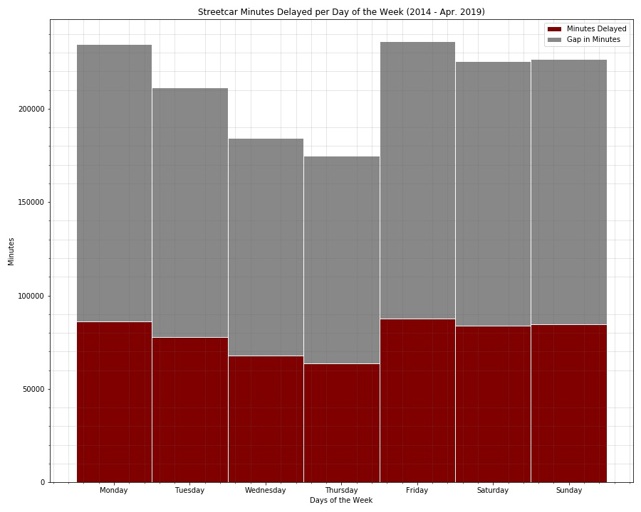

## TTC_Delays

## Authors

- [Daniel Adam Cebula](https://github.com/cebulada)
- [William Lim](https://github.com/naga456)
- [Rohan Chaudhari](https://github.com/focusrohan)
- [Sofiat Ishola](https://github.com/sishola)
- [Tom Callegari](https://github.com/TomCallegari)

___

## Motivation & Summary

- Imagine, you wake up at 6 AM, check Google Maps to plan your commute and see that you have time, you should get to your destination in good time!
- You get ready, arrive at your TTC stop and wait ……  where is the bus?
- Finally! A bus …. You get to the Subway and …
- “Attention all customers, we are currently experiencing delays going Westbound … “
- We have all been there, stuck on the TTC because of some delay.  With this project we are looking to explore TTC (Subway, Streetcar & Bus) delays, narrow in on causes and try to better understand the problems behind the delays.
- We will examine relationships between Routes, Day of the Week, Time of Day, Weather and anything else that comes up along the way.

___

## Data Questions

- Does weather impact Subway delays?
    - How about surface routes (Bus / Streetcar)?
- Does day of the week impact Subway delays?
    - How about surface routes (Bus / Streetcar)?
- What is the relationship between delay incidents and weather?
- What Lines, Routes and Stations were impacted the most by delays?

___

## Extract Transform and Load (ETL)

- Raw data from [Open Data Toronto](https://open.toronto.ca/) consisted of 30+ Excel files, each containing multiple sheets of formatted data.
- Bus, Steetcar, Subway and Scarborough Rapid Transit (SRT) were all separate.
- Supplmental Data for weather, holiday and TTC Geo-Location Data were acquired
    - Weather data was taken from [Canada Historical Weather Data](http://www.climate.weather.gc.ca)
    - Holiday list was taken from [Holidays](https://github.com/uWaterloo/Datasets/blob/master/Holidays/holidays.csv)
    - TTC Geo-Location data was taken from [Open Data Toronto](https://open.toronto.ca/)

___

## TTC Subway Analysis

- In total there are 1946 calendar days recorded in the data collected which represents 5.3 years of data.
- A cumulative sum of 216,403 minutes of system wide delay for a total of 150.28 days of delays.
- This represents approximately 8% of available time as a delay.
- Each day 111.2 mean minutes of delays were recorded with a median of 97 minutes and a daily standard deviation of 75 minutes.

### The following Image is of TTC Subway Locations and the number of total delay incidents.  Added is the [TTC Subway Map](http://www.ttc.ca/Subway/interactive_map/images/subwayMap.svg).  What follows is a table with the total count for each station

| Rank | Station | Count |
| ---:|:-------------:| -----:|
| **1** | KIPLING STATION | 4900 |
| **2** | FINCH STATION | 3562 |
| **3** | WARDEN STATION | 2896 |
| **4** | WILSON STATION | 2655 |
| **5** | EGLINTON STATION | 2591 |
| **6** | ISLINGTON STATION | 2582 |
| **7** | KEELE STATION | 2580 |
| **8** | VICTORIA PARK STATION | 2566 |
| **9** | BLOOR STATION | 2404 |
| **10** | ST CLAIR WEST STATION | 1957 |
| **11** | COXWELL STATION | 1950 |
| **12** | JANE STATION | 1915 |
| **13** | DAVISVILLE STATION | 1725 |
| **14** | LAWRENCE STATION | 1599 |
| **15** | YORK MILLS STATION | 1486 |
| **16** | GREENWOOD STATION | 1440 |
| **17** | UNION STATION | 1365 |
| **18** | EGLINTON WEST STATION | 1357 |
| **19** | OLD MILL STATION | 1311 |
| **20** | SHEPPARD STATION | 1304 |
| **21** | DUNDAS WEST STATION | 1263 |
| **22** | ST CLAIR STATION | 1221 |
| **23** | DUNDAS STATION | 1190 |
| **24** | DUPONT STATION | 1163 |
| **25** | CHRISTIE STATION | 1157 |

### The following is a histogram of the cumulative TTC Subway Minutes Delayed per Day from 2014-2019

### The following is a line graph of the cumulative TTC Subway Incident Counts per day of the week

### The following is a stacked bar graph of the cumlative TTC Subway delay minutes and gap minutes for each day of the week

### The following is a bar graph of the cumulative TTC Subway incident counts for each type of delay description

#### Note:  The bar graph is small in this markdown file but is full size in the source

___

## TTC Bus Analysis

- In total there are 1977 calendar days recorded in the data collected which represents 5.3 years of data.
- A cumulative sum of 4,458,364 minutes of system wide delay for a total of 3096.09 days of delays.
- This represents approximately 1.57% of available time as a delay.
- Each day 2255.12 mean minutes of delays were recorded with a median of 2182 minutes and a daily standard deviation of 776 minutes.

### The following is a histogram of the cumulative TTC Bus Minutes Delayed per Day from 2014-2019

### The following is a line graph of the cumulative TTC Bus Incident Counts per day of the week

### The following is a stacked bar graph of the cumlative TTC Bus delay minutes and gap minutes for each day of the week

### The following is a bar graph of the cumulative TTC Bus incident counts for each type of delay description

___

## TTC Streetcar Analysis

- In total there are 1943 calendar days recorded in the data collected which represents 5.3 years of data.
- A cumulative sum of 551,412 minutes of system wide delay for a total of 382.92 days of delays.
- This represents approximately 0.2% of available time as a delay.
- Each day 283.79 mean minutes of delays were recorded with a median of 265 minutes and a daily standard deviation of 118 minutes.

### The following is a histogram of the cumulative TTC Streetcar Minutes Delayed per Day from 2014-2019

### The following is a line graph of the cumulative TTC Streetcar Incident Counts per day of the week

### The following is a stacked bar graph of the cumlative TTC Streetcar delay minutes and gap minutes for each day of the week

### The following is a bar graph of the cumulative TTC Streetcar incident counts for each type of delay description

___

## Toronto Weather Analysis

1. Toronto Mean Temperature

- TTC Subway

- TTC Bus

- TTC Streetcar

2. Toronto Precipitation (Snow and Rain in mm)

- TTC Subway

- TTC Bus

- TTC Streetcar

3. Toronto Snow on the Ground (cm)

- TTC Subway

- TTC Bus

- TTC Streetcar

4. Toronto Max Windspeed (km/h)

- TTC Subway

- TTC Bus

- TTC Streetcar

___

## Weekday Analysis of all 3 TTC system routes

### According to former TTC spokesman [Brad Ross](https://www.blogto.com/city/2014/04/when_exactly_is_rush_hour_in_toronto/) the busiest TTC times are during the morning and afternoon rush hours

### The data was thus divided into 4 timezones:

1. Morning Rush Hour
- 6:30 AM – 10:00 AM
2. During the Day
- 10:00 AM – 3:30 PM
3. Afternoon Rush Hour
- 3:30 PM – 7:00 PM
4. Off Hours
- 7:00 PM – 6:30 AM

### The following is an overall analysis of the 3 TTC system routes

### The following is an analysis of the TTC subway for the 4 timezones for weekdays and weekends in boxplot and tabular format

### The following is an analysis of the TTC bus for the 4 timezones for weekdays and weekends in boxplot and tabular format

### The following is an analysis of the TTC streetcar for the 4 timezones for weekdays and weekends in boxplot and tabular format

#### Note:  The green line is the median and the blue square is the mean of the data.  Clearly it is not normally distributed

___

## Discussion

- It appears weather has no discernable role in subway delays.  This makes sense as the subway system is mostly underground, on rails and have sturdy infrastructure.  As for buses and streetcars the same holds true.  Weather just does not impact TTC delays, whether it be rain, snow or temperature.
- The top 5 stations for reporting delay incidents are Kipling, Finch, Warden, Wilson and Eglinton Stations.  The top two are terminal stations, Kipling and Finch.  Mike Palmer, the TTC chief operations officer, has explained that most delays occur at terminal stations as most issues are not discovered until then ([Reference](https://www.thestar.com/news/gta/2017/06/12/whats-keeping-that-train-the-ttc-has-69000-reasons-why.html)).  These delays account for 8% of total time available in the subway operating hours.
- For the subway it appears that delays spike during morning and afternoon rush hours while remaining steady throughout the day and decreasing sharply in off hours.
- Comparing the delays across the 3 TTC services (subway, bus and streetcar) it is clear that the populations are significantly different.  However they do not differ in terms of the day of the week or time of day.

___

## Post Mortem

- The datasets we have gathered came from multiple sources.  For most we needed to only manually download the .xlsx or .csv files from the respective websites. Maybe rename them for easier data munging.  In regards to the subway location data and holiday list data we acquired them from third party sources which may be an issue if these third parties made a mistake.
- The weather dataset was acquired from the government of Canada from this [website](https://www.canada.ca/en/services/environment/weather.html).  However the website required the use of wget module in cygwin64 program in order to download the .xlsx files in bulk from different weather stations.  This took some time to learn the commands required to access the weather data.
- Cleaning the data provided from the TTC was an issue as well.  Several columns in the subway, bus and streetcar data, such as route, station name and direction, which were filled with numerous misspellings, short forms and unknown values which we could not make heads or tails out of.  Attempts were made and the stations names were cleaned up sufficiently enough to present a heatmap of delay reports per station.
- Due to the delay time data not being normally distributed it is difficult to apply any statistical tests.  Non-parametric tests could be used but were not done due to time constraints.