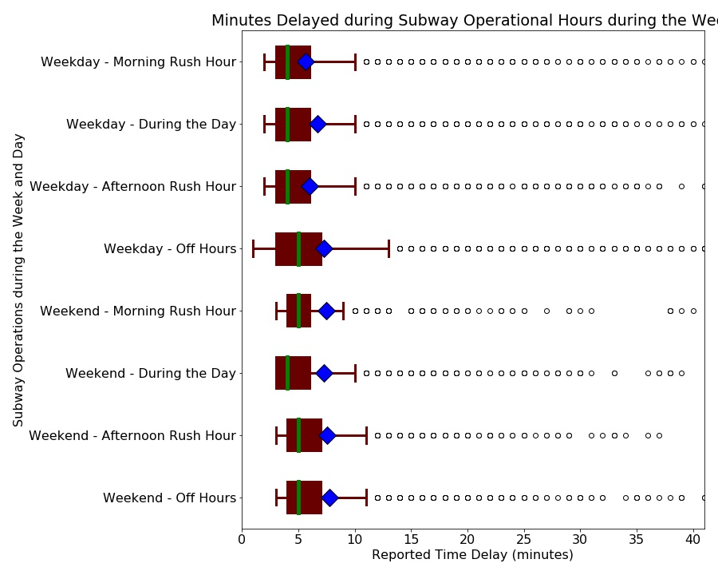

SUBWAY
 ||**Total Days**|**Total Minutes**|**Days Delayed**|**Mean Min. per Day**|**Median Min. per Day**|**% of Days Delayed**|**Daily Sigma**|**Delay Variance**
:-----:|:-----:|:-----:|:-----:|:-----:|:-----:|:-----:|:-----:|:-----:
Stats|1946|216403|150.28|111.2|97.0|0.08|74.96|5619.0

BUS
 ||**Total Days**|**Total Minutes**|**Days Delayed**|**Mean Min. per Day**|**Median Min. per Day**|**% of Days Delayed**|**Daily Sigma**|**Delay Variance**
:-----:|:-----:|:-----:|:-----:|:-----:|:-----:|:-----:|:-----:|:-----:
Stats|1977|4458364.0|3096.09|2255.12|2182.0|1.57|775.51|601415.76

STREETCAR
 ||**Total Days**|**Total Minutes**|**Days Delayed**|**Mean Min. per Day**|**Median Min. per Day**|**% of Days Delayed**|**Daily Sigma**|**Delay Variance**
:-----:|:-----:|:-----:|:-----:|:-----:|:-----:|:-----:|:-----:|:-----:
Stats|1943|551412.0|382.92|283.79|265.0|0.2|118.19|13968.88

